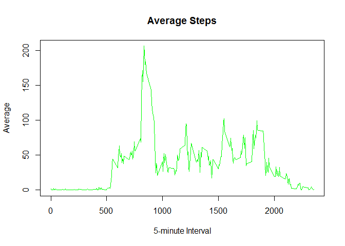

# Reproducible Research: Peer Assessment 1
This rmd file was created by Arturo for the Reproducible Research class.

##  Background
The purpose of this project is to start using markup language. 
The data for this document can be found in my repository in Github, but was downloaded from 
[Activity.zip file](https://d396qusza40orc.cloudfront.net/repdata%2Fdata%2Factivity.zip)

The variables included in this dataset are:

    steps: Number of steps taking in a 5-minute interval (missing values are coded as NA)
    date: The date on which the measurement was taken in YYYY-MM-DD format
    interval: Identifier for the 5-minute interval in which measurement was taken

The dataset is stored in a comma-separated-value (CSV) file and there are a total of 17,568 observations in this dataset.


This original file was Forked/cloned from the GitHub repository created for this assignment. 
Submition for this assignment by will consist of the URL to your GitHub repository and the SHA-1 commit ID for your repository state.

For this assignment, I used the packages, timeDate and ggplot2

```r
options(repos=c(CRAN="http://cran.cnr.berkeley.edu/"))
install.packages("timeDate") 
```

```
## Installing package into 'C:/Users/Art/Documents/R/win-library/3.2'
## (as 'lib' is unspecified)
```

```
## package 'timeDate' successfully unpacked and MD5 sums checked
## 
## The downloaded binary packages are in
## 	C:\Users\Art\AppData\Local\Temp\RtmpQVWloM\downloaded_packages
```

```r
install.packages("ggplot2")
```

```
## Installing package into 'C:/Users/Art/Documents/R/win-library/3.2'
## (as 'lib' is unspecified)
```

```
## package 'ggplot2' successfully unpacked and MD5 sums checked
## 
## The downloaded binary packages are in
## 	C:\Users\Art\AppData\Local\Temp\RtmpQVWloM\downloaded_packages
```

```r
install.packages("lattice")
```

```
## Installing package into 'C:/Users/Art/Documents/R/win-library/3.2'
## (as 'lib' is unspecified)
```

```
## package 'lattice' successfully unpacked and MD5 sums checked
```

```
## Warning: cannot remove prior installation of package 'lattice'
```

```
## 
## The downloaded binary packages are in
## 	C:\Users\Art\AppData\Local\Temp\RtmpQVWloM\downloaded_packages
```

```r
library(timeDate)
library(lattice) 
library(ggplot2)
```

## Loading and preprocessing the data

I loaded the data using the following commands... after setting my working directory.


```r
zfname <- "activity.zip"
unzip(zfname)
df <-read.csv("activity.csv")
dfclean <- df[complete.cases(df),]
```


## What is mean total number of steps taken per day?

*What is mean total number of steps taken per day?
  For this part of the assignment, you can ignore the missing values in the dataset.
  Make a histogram of the total number of steps taken each day
  Calculate and report the mean and median total number of steps taken per day

```r
stepsPerDay<-aggregate(steps ~ date , dfclean, sum)

qplot(stepsPerDay$steps, main = "Steps per Day", xlab = "Steps Per Day",  fill=I("blue"), col=I("red"), alpha=I(.2))
```

```
## `stat_bin()` using `bins = 30`. Pick better value with `binwidth`.
```


```r
stepsMean<-mean(stepsPerDay$steps)
stepsMedian<-median(stepsPerDay$steps)
stepsMean
```

```
## [1] 10766.19
```

```r
stepsMedian
```

```
## [1] 10765
```


## What is the average daily activity pattern?

*Make a time series plot (i.e. type = "l") of the 5-minute interval (x-axis) and the average number of steps taken, averaged across all days (y-axis)

```r
meanStepsPerInterval <- aggregate(steps ~ interval, df , mean)
plot( meanStepsPerInterval$interval, meanStepsPerInterval$steps, type = "l", xlab = "5-minute Interval", ylab = "Average", main = "Average Steps", col = "green")
```



```r
head(meanStepsPerInterval)
```

```
##   interval     steps
## 1        0 1.7169811
## 2        5 0.3396226
## 3       10 0.1320755
## 4       15 0.1509434
## 5       20 0.0754717
## 6       25 2.0943396
```


*Which 5-minute interval, on average across all the days in the dataset, contains the maximum number of steps?

```r
meanStepsPerInterval$interval[which.max(meanStepsPerInterval$steps)]
```

```
## [1] 835
```

*Imputing missing values
*Note that there are a number of days/intervals where there are missing values (coded as NA). The presence of missing days may introduce bias into 
*some calculations or summaries of the data.

*Calculate and report the total number of missing values in the dataset (i.e. the total number of rows with NAs)
#Devise a strategy for filling in all of the missing values in the dataset. The strategy does not need to be sophisticated. For example, you could use the mean/median for that day, or the mean for that 5-minute interval, etc.


```r
sum(is.na(df))
```

```
## [1] 2304
```

```r
dfmean <- df
dfmean$steps[which(is.na(dfmean$steps))] <- mean(dfmean$steps, na.rm = TRUE)
```

## Imputing missing values
*Create a new dataset that is equal to the original dataset but with the missing data filled in.
*Make a histogram of the total number of steps taken each day and Calculate and report the mean and median total number of steps taken per day. 


```r
dfmeanStepsPerDay<-aggregate(steps ~ date , dfmean,sum)

qplot(dfmeanStepsPerDay$steps, main = "Steps per Day", xlab = "Steps Per Day",  fill=I("blue"), col=I("red"), alpha=I(.2))
```

```
## `stat_bin()` using `bins = 30`. Pick better value with `binwidth`.
```


*Calculate the mean and median for steps across all days


```r
dfmeanStepsMean<-mean(dfmeanStepsPerDay$steps)
dfmeanStepsMedian<-median(dfmeanStepsPerDay$steps)
dfmeanStepsMean
```

```
## [1] 10766.19
```

```r
dfmeanStepsMedian
```

```
## [1] 10766.19
```

*Do these values differ from the estimates from the first part of the assignment? What is the impact of imputing missing data on the estimates of the total daily number of steps?
  * the impact of the missing data is quite low. 
  
  ## Are there differences in activity patterns between weekdays and weekends?


```r
dfmean$dayweek <- weekdays(as.Date(dfmean$date))
#dfmean$dayweek
weekdays1 <- c('Monday', 'Tuesday', 'Wednesday', 'Thursday', 'Friday')
dfmean$weekend <- factor((weekdays(as.Date(dfmean$date)) %in% weekdays1), levels=c(FALSE, TRUE), labels=c('weekend', 'weekday')) 
```

* averaged across all weekday days or weekend days (y-axis). See the README file in the GitHub repository to see an example of what this plot 
* should look like using simulated data.


```r
dfmeanFromStepsIntWeekend <- aggregate( steps ~ interval * weekend, data = dfmean, mean)
```


 
* Make a panel plot containing a time series plot (i.e. type = "l") of the 5-minute interval (x-axis) and the average number of steps taken, 

```r
xyplot(steps ~ interval | weekend, dfmeanFromStepsIntWeekend, type = "l", layout = c(1, 2), xlab = "Interval", ylab = "Average Number of steps")
```


